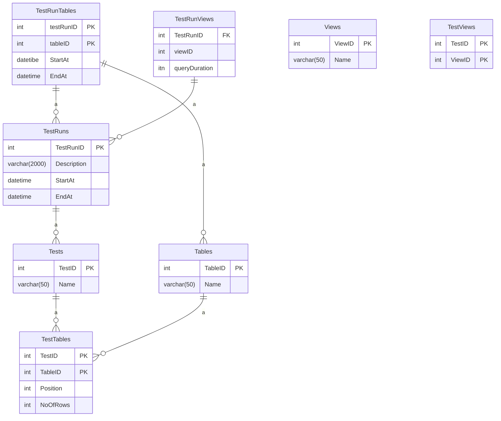

# Lab 10
## T1

```sql
INSERT INTO TestRuns(TestID, RunDate)
VALUES(@TestID, GETDATE())
```



## T2
Delete all the rows in a table below a certain index

```sql
DECLARE table_cursor CURSOR FOR 
SELECT t.TableName
FROM Tables t INNER JOIN TestTables tt on t.tableID = tt.tableID
WHERE tt.TestID = @TestID
ORDER BY tt.Position ASC

OPEN table_cursor 
FETCH NEXT FROM table_cursor INTO @TableName
SET @SQL = 'Delete' + @TableName
FETCH
CLOSE
```

One test: take a specific position in a table and delete everything below it; register the position and the number of rows below it

azure data factory, databricks, apache --> cloud tools --> check integrated cursors
pyspark

## T3
insert the rows back in the table

## T4

```sql

```

