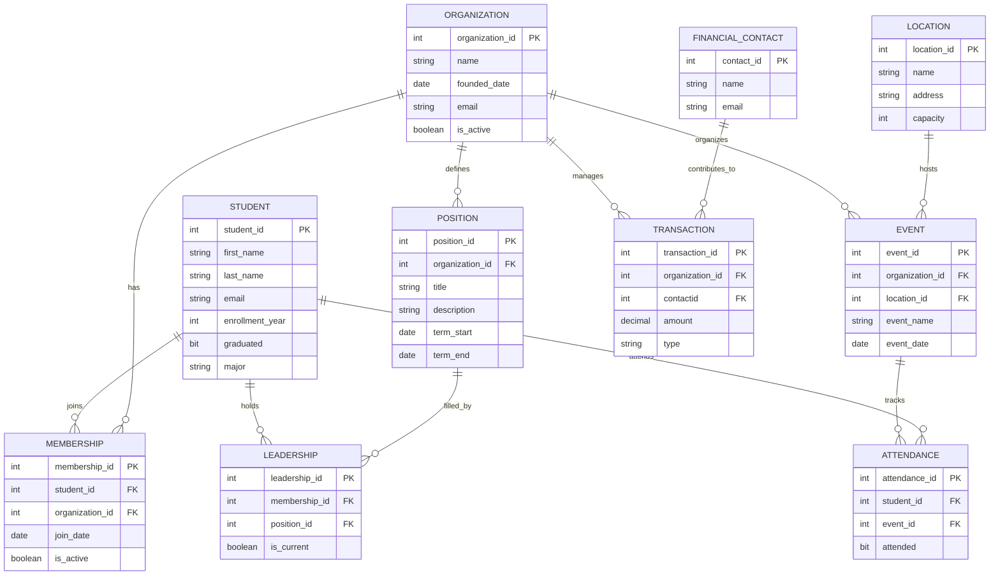

# Student Organisations Database

```mermaid
erDiagram
    STUDENT ||--o{ MEMBERSHIP : "joins"
    ORGANIZATION ||--o{ MEMBERSHIP : "has"
    ORGANIZATION ||--o{ POSITION : "defines"
    STUDENT ||--o{ LEADERSHIP : "holds"
    POSITION ||--o{ LEADERSHIP : "filled_by"
    ORGANIZATION ||--o{ EVENT : "organizes"
    EVENT ||--o{ ATTENDANCE : "tracks"
    STUDENT ||--o{ ATTENDANCE : "attends"
    LOCATION ||--o{ EVENT : "hosts"
    ORGANIZATION ||--o{ TRANSACTION : "manages"
    FINANCIAL_CONTACT ||--o{ TRANSACTION : "contributes_to"

    STUDENT {
        int student_id PK
        string first_name
        string last_name
        string email
        int enrollment_year
        bit graduated
        string major
    }

    ORGANIZATION {
        int organization_id PK
        string name
        date founded_date
        string email
        boolean is_active
    }

    MEMBERSHIP {
        int membership_id PK
        int student_id FK
        int organization_id FK
        date join_date
        boolean is_active
    }

    POSITION {
        int position_id PK
        int organization_id FK
        string title
        string description
        date term_start
        date term_end
    }

    LEADERSHIP {
        int leadership_id PK
        int membership_id FK 
        int position_id FK
        boolean is_current
    }
	LOCATION {
        int location_id PK
        string name
        string address
        int capacity
    }
    
    EVENT {
        int event_id PK
        int organization_id FK
        int location_id FK
        string event_name
        date event_date
    }
    
    ATTENDANCE {
        int attendance_id PK
        int student_id FK
        int event_id FK
        bit attended
    }
    
    FINANCIAL_CONTACT {
        int contact_id PK
        string name
        string email
    }
    
    TRANSACTION {
        int transaction_id PK
        int organization_id FK
        int contactid FK
        decimal amount
        string type 
    }
```

