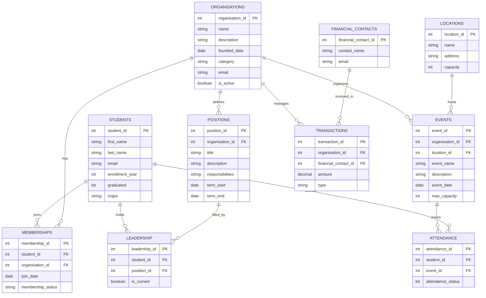

# Student Organisations Database

```mermaid
erDiagram
    STUDENTS ||--o{ MEMBERSHIPS : "joins"
    ORGANISATIONS ||--o{ MEMBERSHIPS : "has"
    ORGANISATIONS ||--o{ POSITIONS : "defines"
    STUDENTS ||--o{ LEADERSHIP : "holds"
    POSITIONS ||--o{ LEADERSHIP : "filled_by"
    ORGANISATIONS ||--o{ EVENTS : "organizes"
    EVENTS ||--o{ ATTENDANCE : "tracks"
    STUDENTS ||--o{ ATTENDANCE : "attends"
    LOCATIONS ||--o{ EVENTS : "hosts"
    ORGANISATIONS ||--o{ TRANSACTIONS : "manages"
    FINANCIAL_CONTACTS ||--o{ TRANSACTIONS : "involved_in"

    STUDENTS {
        int student_id PK
        string first_name
        string last_name
        string email
        int enrollment_year
        bit graduated
        string major
    }

    ORGANISATIONS {
        int organisation_id PK
        string name
        string description
        date founded_date
        string category
        string email
        boolean is_active
    }

    MEMBERSHIPS {
        int membership_id PK
        int student_id FK
        int organisation_id FK
        date join_date
        string membership_status
    }

    POSITIONS {
        int position_id PK
        int organisation_id FK
        string title
        string description
        string responsibilities
        date term_start
        date term_end
    }

    LEADERSHIP {
        int leadership_id PK
        int student_id FK
        int position_id FK
        boolean is_current
    }

    EVENTS {
        int event_id PK
        int organisation_id FK
        int location_id FK
        string event_name
        string description
        date event_date
        int max_capacity
    }

    ATTENDANCE {
        int attendance_id PK
        int student_id FK
        int event_id FK
        bit attendance_status
    }

    LOCATIONS {
        int location_id PK
        string name
        string address
        int capacity
    }

    TRANSACTIONS {
        int transaction_id PK
        int organisation_id FK
        int financial_contact_id FK
        decimal amount
        string type
    }

    FINANCIAL_CONTACTS {
        int financial_contact_id PK
        string contact_name
        string email
    }
```

